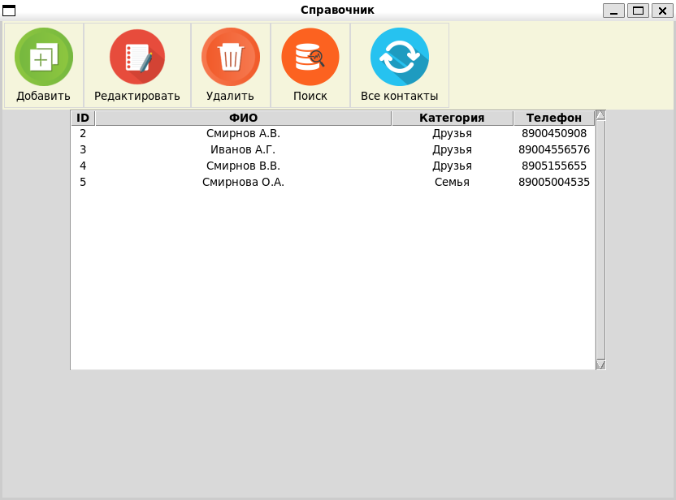

# Телефонный справочник

При запуске приложения вы увидите всплывающее окно со списком существующих в БД по умолчанию адресатов. В интерфейсе доступны следующие опции:

* Добавить новый контакт
* Редактировать выбранный контакт
* Удалить выбранный контакт
* Найти контакт по любому столбцу
* Отобразить все

## Интерфейс
